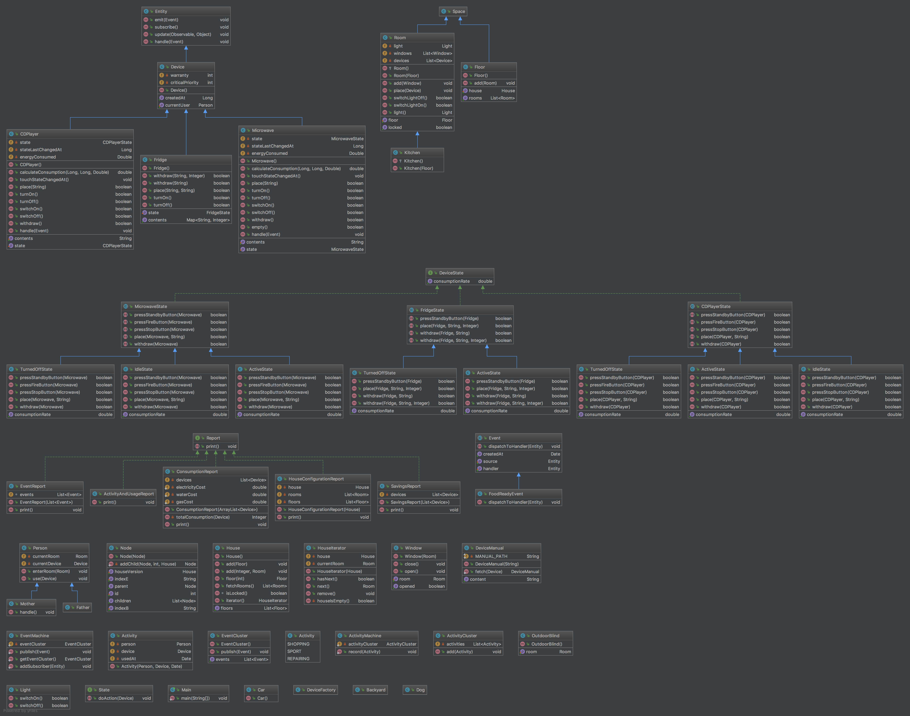

# Smart home
Semestral project for Object Design &amp; Modeling class

Authors: Peter Toth, Vu Tien Trang, Marek Dlugos

## :books: Docs

### Design patterns used

- Iterator — class HouseIterator that iterates rooms
- State Machine — package activity that records activities
- Observer & Listener - notifying people about events that happened
- Lazy Initialization - loading the device manuals
- Singleton -
...

### Our solution

- Manuals - saved in JSON in manuals.json
- Generating events - 
- Full data persistence - helps us preserve all the states of the entities in our application (includes history).
...