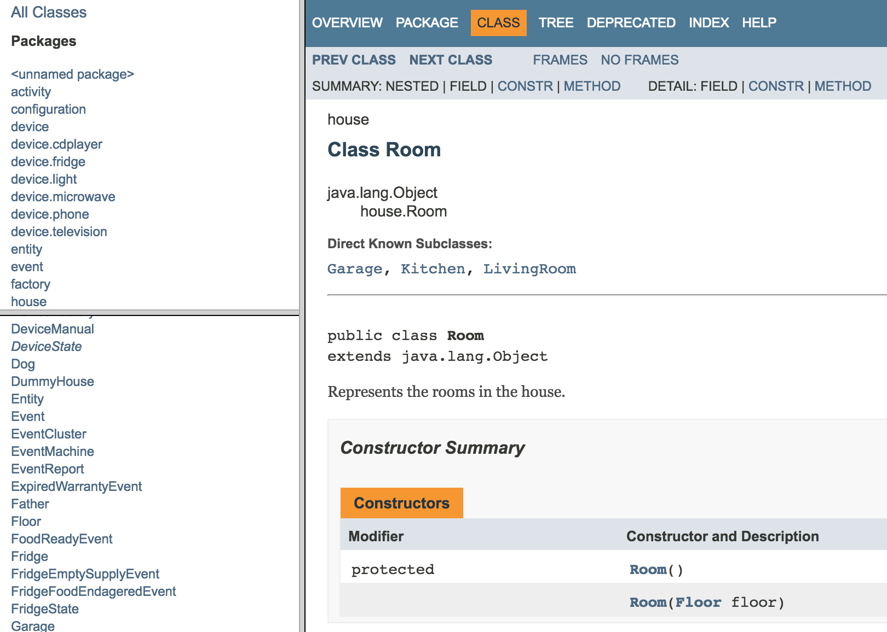

# Smart home
Semestral project for Object Design &amp; Modeling class

This repository implements and simulates the House with people, devices and animals. Those entities might generate events and perform activities. At the end of the simulation, different reports are printed into the text file. Those are giving user a picture about House configuration (number of floors, rooms, people and all the other entities), consumption (and cost), events happened (who has emitted them and who has handled them) etc..    

Authors: Peter Toth, Vu Tien Trang, Marek Dlugos

## :books: Docs

### Design patterns used

- Iterator — class HouseIterator that iterates rooms
- State Machine — package activity that records activities
- Observer & Listener - notifying people about events that happened
- Lazy Initialization - loading the device manuals
- Singleton - Container for Events & Activities
...

### Our solution

- Manuals - saved in JSON in manuals.json
- Generating events - 
- Full data persistence - helps us preserve all the states of the entities in our application (includes history).
...

## JavaDoc

For more information don't hesitate to visit the JavaDoc in `javadoc` folder.

